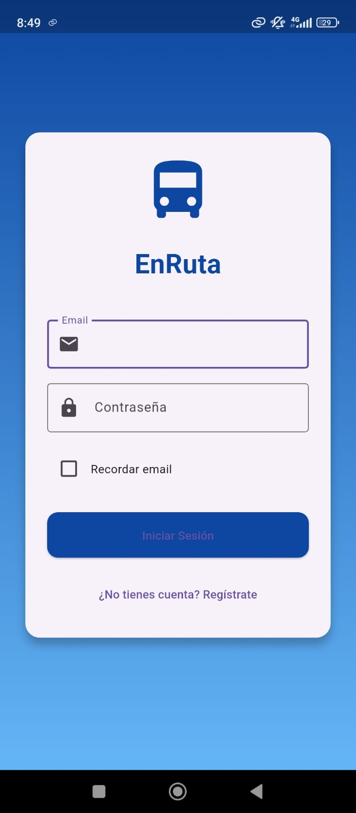
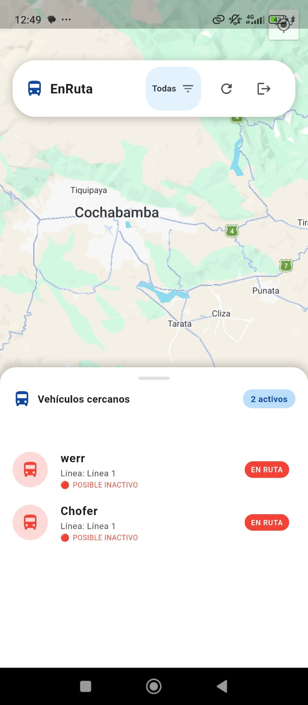
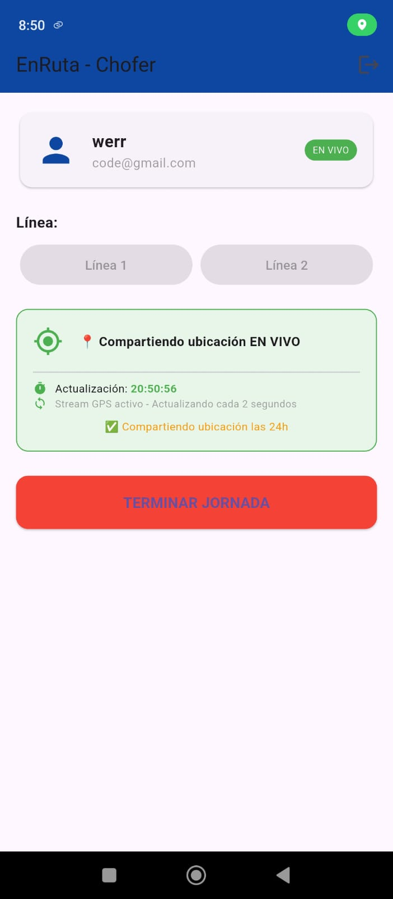

# 🚍 EnRuta App


## 📖 Descripción

**EnRuta App** es una aplicación móvil desarrollada para mejorar la experiencia del transporte público y provincial mediante seguimiento en tiempo real.

La aplicación permite que los conductores compartan su ubicación en vivo para que los pasajeros puedan visualizar dónde se encuentra el vehículo y anticipar su salida hacia la carretera o punto de parada.

El proyecto nace como solución a un problema común en provincias y rutas donde existen pocas líneas de transporte y largas esperas sin información.

---

## ✨ Características

- 📍 Ubicación en tiempo real
- 🚐 Seguimiento de vehículos
- 🗺️ Visualización en mapa
- 📱 Interfaz moderna y simple
- ⚡ Actualización en vivo
- 🔒 Permisos y control de ubicación
- 📡 Integración con GPS del dispositivo

---

## 🛠️ Tecnologías utilizadas

### Frontend
- Flutter
- Dart

### Backend y servicios
- Firebase
- Firestore
- Firebase Authentication
- Realtime Database

### Mapas y ubicación
- Google Maps API
- Geolocator
- GPS del dispositivo

### Herramientas
- Android Studio
- VS Code
- Git & GitHub

---

## 📷 Capturas de la aplicación

| Inicio | Mapa en tiempo real | Seguimiento |
|---|---|---|
|  |  |
|  |

---

## 🧩 Arquitectura del proyecto

El proyecto está organizado usando una estructura modular para facilitar mantenimiento y escalabilidad.

```bash
lib/
├── screens/
├── widgets/
├── services/
├── models/
├── controllers/
├── utils/
└── main.dart
```

---

## 🚀 Instalación

Clonar repositorio:

```bash
git clone https://github.com/NiwreDev21/EnRuta.git
```

Entrar al proyecto:

```bash
cd EnRuta
```

Instalar dependencias:

```bash
flutter pub get
```

Ejecutar aplicación:

```bash
flutter run
```

---

## 📱 APK

Puedes descargar y probar la aplicación desde:

[Descargar APK](./build/app/outputs/apk/release/app-release.apk)

---

## 🎯 Objetivo del proyecto

El objetivo principal es ofrecer una solución tecnológica simple para el transporte provincial y urbano, permitiendo reducir tiempos de espera y mejorar la organización de pasajeros y conductores.

Además, el proyecto sirve para fortalecer conocimientos en:

- Desarrollo móvil con Flutter
- Geolocalización
- Tiempo real con Firebase
- Integración de mapas
- Arquitectura de aplicaciones móviles

---


## ⭐ Estado del proyecto

🚧 Proyecto en desarrollo activo

---

## 📄 Licencia

Este proyecto está bajo la licencia MIT.